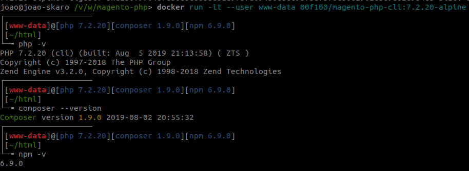

# Magento PHP - Docker

All images have UID=1000

If you have different, please build a local image.

## Alpine

### PHP 7.2.20 + Composer 1.9.0 + NPM 6.9.0

##### Simple use:
```
$ docker run -it --rm --user www-data 00f100/magento-php-cli:7.2.20-alpine
```

##### Custom php.ini
```
docker run -it --rm --user www-data -v path/to/php.ini:/opt/php/lib/php.ini 00f100/magento-php-cli:7.2.20-alpine
```

##### Build image

This process update UID of image to fix permissions error

```
$ git clone git@github.com:00F100/magento-php.git
$ cd magento-php
$ make alpine-php-cli-fpm-7-2-20
```



